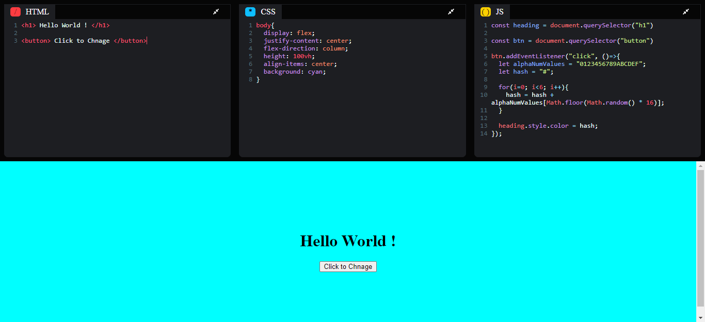

# React Codepen

## Description

This React app is a CodePen clone with a basic functionality. It uses CodeMirror and react-codemirror-2 libraries to provide users with a text editor to write and edit HTML, CSS, and JavaScript code snippets. The app also allows users to save their snippets in localStorage.

## Links for Project

- ### 📌 [LIVE Project Link](https://react-code-pen.netlify.app/)

- ### 📌 [YouTube Link](https://youtu.be/BaItHRxpqcE)

## Tech Stack Used

## Project Screen Shot(s)

### Home Page

[GO TO TOP](#react-codepen)
